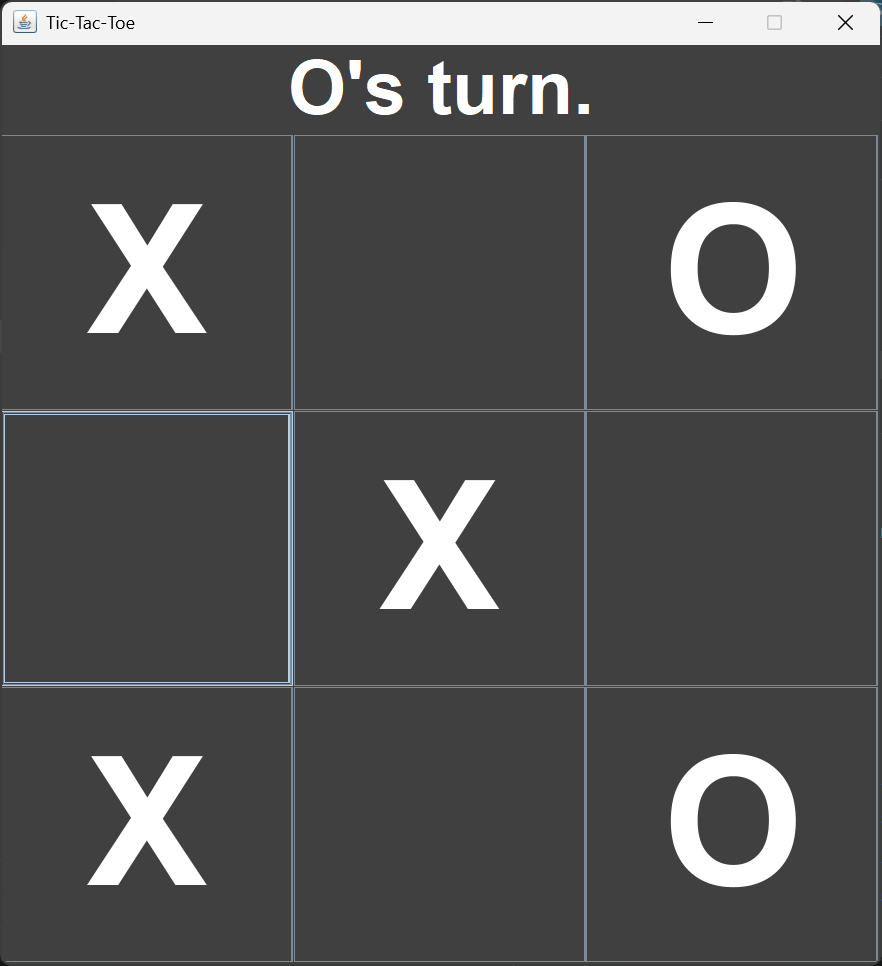

# Tic-Tac-Toe Game in Java

A desktop-based Tic-Tac-Toe game developed using Java Swing and AWT.  
This project demonstrates GUI development, event handling, arrays, and object-oriented programming concepts in Java.

---

## Features

- Interactive 3x3 Tic-Tac-Toe board
- Two-player gameplay
- Winner detection system
- Tie detection system
- Dynamic player turn display
- GUI built using Java Swing
- Color indication for winner and tie states
- Simple and clean user interface

---

## Technologies Used

- Java
- Java Swing
- AWT
- Object-Oriented Programming (OOP)

---

## Project Structure

```plaintext
TicTacToe/
│
├── App.java
├── Tictactoe.java
├── README.md
└── .gitignore
```

---

## How to Run

### 1. Clone the Repository

```bash
git clone https://github.com/your-username/java-tic-tac-toe-game.git
```

### 2. Open Project

Open the project in:
- IntelliJ IDEA
- VS Code
- Eclipse

---

### 3. Compile the Files

```bash
javac *.java
```

---

### 4. Run the Program

```bash
java App
```

---

## Concepts Used

- Java Swing GUI
- Event Handling
- Arrays
- GridLayout
- Conditional Logic
- Object-Oriented Programming

---

## Improvements Made

- Implemented winner and tie detection
- Added color-based winner highlighting
- Used event-driven programming
- Improved string comparison using `.equals()` and `.isEmpty()`

---

## Future Enhancements

- Single-player AI mode
- Restart game button
- Score tracking
- Sound effects
- Responsive UI improvements

---

## Screenshots


Example:

```md

```

---

## Author

**Satwik Pawar**

IT Engineering Student | Java Developer | Learning Full Stack Development

---